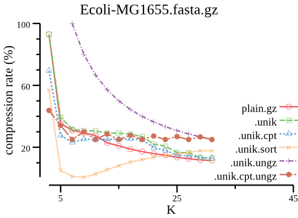
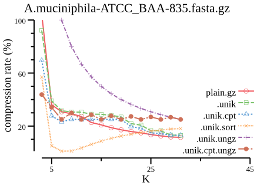

# unikmer

unikmer (unique Kmer) is a golang package and a command-line toolkit for
manipulating small [Kmers](https://en.wikipedia.org/wiki/K-mer) (k <= 32)
while NOT recording Kmer frequencies.

Every Kmer (k <= 32) is encoded into `uint64`,
and Kmers are stored in builtin `map` of golang in RAM,
no probabilistic data structures are used (I've tested and abandoned them).

<!-- START doctoc generated TOC please keep comment here to allow auto update -->
<!-- DON'T EDIT THIS SECTION, INSTEAD RE-RUN doctoc TO UPDATE -->
## Table of Contents

- [The package](#the-package)
    - [Installation](#installation)
    - [Benchmark](#benchmark)
- [The toolkit](#the-toolkit)
    - [Installation](#installation-1)
    - [Commands](#commands)
    - [Binary file (.unik)](#binary-file-unik)
    - [Quick Start](#quick-start)
- [Contributing](#contributing)
- [License](#license)

<!-- END doctoc generated TOC please keep comment here to allow auto update -->

## The package

The unikmer package provides basic manipulations of unique small Kmers (NOT including
Kmer frequencies) and provides serialization methods.

### Installation

    go get -u github.com/shenwei356/unikmer

### Benchmark

    $ go test . -bench=Bench* -benchmem
    goos: linux
    goarch: amd64
    pkg: github.com/shenwei356/unikmer
    BenchmarkEncodeK32-16                           50000000                25.8 ns/op             0 B/op          0 allocs/op
    BenchmarkEncodeFromFormerKmerK32-16             200000000               9.42 ns/op             0 B/op          0 allocs/op
    BenchmarkMustEncodeFromFormerKmerK32-16         1000000000              1.95 ns/op             0 B/op          0 allocs/op
    BenchmarkDecodeK32-16                           20000000                82.2 ns/op            32 B/op          1 allocs/op
    BenchmarkRevK32-16                              50000000                20.2 ns/op             0 B/op          0 allocs/op
    BenchmarkCompK32-16                             50000000                27.8 ns/op             0 B/op          0 allocs/op
    BenchmarkRevCompK32-16                          100000000               21.9 ns/op             0 B/op          0 allocs/op

## The toolkit

`unikmer` is a command-line toolkit providing some functions including counting,
format convertion, set operations and searching on unique Kmers.

### Installation

1. Download [binary files](https://github.com/shenwei356/unikmer/releases).

1. Bioconda (not available now)

        conda install unikmer

### Commands

1. Counting

        count           count Kmer from FASTA/Q sequences
        subset          extract smaller Kmers from binary file

1. Format conversion

        view            read and output binary format to plain text
        dump            convert plain Kmer text to binary format

1. Set operations

        inter           intersection of multiple binary files
        union           union of multiple binary files
        concat          concatenate multiple binary files without removing duplicates
        diff            set difference of multiple binary files
        sample          sample Kmers from binary files
        sort            sort binary files

1. Searching

        grep            search Kmer from binary file

1. Misc

        stats           statistics of binary files
        num             print number of Kmers in binary file
        genautocomplete generate shell autocompletion script
        help            Help about any command
        version         print version information and check for update

### Binary file (.unik)

Kmers (represented in `uint64` in RAM ) are serialized in 8-Byte
(or less Bytes for shorter Kmers in compact format,
or much less Bytes for sorted Kmers) arrays and
optionally compressed in gzip format with extension of `.unik`.

#### Compression rate comparison

label           |encoded-kmera|gzip-compressedb|compact-formatc|sortedd|comment
:---------------|:-----------------------|:--------------------------|:-------------------------|:-----------------|:------------------------------------------------------
`plain`         |                        |                           |                          |                  |plain text
`plain.gz`      |                        |✔                          |                          |                  |gzipped plain text
`.unik`         |✔                       |✔                          |                          |                  |gzipped encoded kmer in fixed-length byte array
`.unik.cpt`     |✔                       |✔                          |✔                         |                  |gzipped encoded kmer in shorter fixed-length byte array
`.unik.sort`    |✔                       |✔                          |                          |✔                 |gzipped sorted encoded kmers
`.unik.ungz`    |✔                       |                           |                          |                  |encoded kmer in fixed-length byte array
`.unik.cpt.ungz`|✔                       |                           |✔                         |                  |encoded kmer in shorter fixed-length byte array

- a One Kmer is encoded as `uint64` and serialized in 8 Bytes.
- b Kmers file is compressed in gzip format by default,
  users can switch on global option `-C/--no-compress` to output non-compressed file.
- c One Kmer is encoded as `uint64` and serialized in 8 Bytes by default.
 However few Bytes are needed for short Kmers, e.g., 4 Bytes are enough for
  15-mers (30 bits). This makes the file more compact with smaller file size,
  controled by global option `-c/--compact `.
- d One Kmer is encoded as `uint64`, all kmers are sorted and compressed
  using varint-GB algorithm.
- In all test, flag `--canonical` is ON when running `unikmer count`.

### Quick Start

    # memusg is for compute time and RAM usage: https://github.com/shenwei356/memusg

    # counting
    $ memusg -t unikmer count -k 23 Ecoli-MG1655.fasta.gz -o Ecoli-MG1655.fasta.gz.k23
    elapsed time: 2.633s
    peak rss: 425.98 MB

    $ ls -lh Ecoli-MG1655.fasta.gz.k23.unik
    -rw-r--r-- 1 shenwei shenwei 30M 9月  23 14:13 Ecoli-MG1655.fasta.gz.k23.unik

    # counting (only keep the canonical kmers)
    $ memusg -t unikmer count -k 23 Ecoli-MG1655.fasta.gz -o Ecoli-MG1655.fasta.gz.k23 --canonical
    elapsed time: 1.536s
    peak rss: 236.05 MB

    $ ls -lh Ecoli-MG1655.fasta.gz.k23.unik
    -rw-r--r-- 1 shenwei shenwei 22M 9月  23 14:14 Ecoli-MG1655.fasta.gz.k23.unik

    # counting (only keep the canonical kmers and compact output)
    # memusg -t unikmer count -k 23 Ecoli-IAI39.fasta.gz -o Ecoli-IAI39.fasta.gz.k23 --canonical --compact
    $ memusg -t unikmer count -k 23 Ecoli-MG1655.fasta.gz -o Ecoli-MG1655.fasta.gz.k23 --canonical --compact
    elapsed time: 1.540s
    peak rss: 238.54 MB

    $ ls -lh Ecoli-MG1655.fasta.gz.k23.unik
    -rw-r--r-- 1 shenwei shenwei 19M 9月  23 14:15 Ecoli-MG1655.fasta.gz.k23.unik

    # counting (only keep the canonical kmers and sort Kmers)
    # memusg -t unikmer count -k 23 Ecoli-IAI39.fasta.gz -o Ecoli-IAI39.fasta.gz.k23.sorted --canonical --compact --sort
    $ memusg -t unikmer count -k 23 Ecoli-MG1655.fasta.gz -o Ecoli-MG1655.fasta.gz.k23.sorted --canonical --compact --sort
    elapsed time: 2.847s
    peak rss: 337.11 MB

    $ ls -lh Ecoli-MG1655.fasta.gz.k23.sorted.unik
    -rw-r--r-- 1 shenwei shenwei 16M 10月  6 23:23 Ecoli-MG1655.fasta.gz.k23.sorted.unik

    # view
    $ unikmer view Ecoli-MG1655.fasta.gz.k23.unik | head -n 3
    AGCTTTTCATTCTGACTGCAACG
    CCGTTGCAGTCAGAATGAAAAGC
    CCCGTTGCAGTCAGAATGAAAAG

    # stats
    $ unikmer stats Ecoli-MG1655.fasta.gz.k23.*unik -a
    file                                    k  gzipped  compact  canonical  sorted     number
    Ecoli-MG1655.fasta.gz.k23.sorted.unik  23  true     true     true       true    4,546,632
    Ecoli-MG1655.fasta.gz.k23.unik         23  true     true     true       false   4,546,632

    # union
    $ time unikmer union Ecoli-MG1655.fasta.gz.k23.sorted.unik Ecoli-IAI39.fasta.gz.k23.sorted.unik -o union.k23 -c -s
    real    0m4.880s
    user    0m5.741s
    sys     0m0.140s

    # concat
    $ time unikmer concat Ecoli-MG1655.fasta.gz.k23.sorted.unik Ecoli-IAI39.fasta.gz.k23.sorted.unik -o concat.k23 -c
    real    0m1.620s
    user    0m2.820s
    sys     0m0.030s

    # intersection
    $ time unikmer inter Ecoli-MG1655.fasta.gz.k23.sorted.unik Ecoli-IAI39.fasta.gz.k23.sorted.unik -o inter.k23 -c -s
    real    0m2.881s
    user    0m3.517s
    sys     0m0.106s

    # difference
    $ time unikmer diff -j 1 Ecoli-MG1655.fasta.gz.k23.sorted.unik Ecoli-IAI39.fasta.gz.k23.sorted.unik -o diff.k23 -c -s
    real    0m2.872s
    user    0m2.790s
    sys     0m0.080s

    $ ls -lh *.unik
    -rw-r--r-- 1 shenwei shenwei  47M 10月  9 22:57 concat.k23.unik
    -rw-r--r-- 1 shenwei shenwei 7.1M 10月  9 22:54 diff.k23.unik
    -rw-r--r-- 1 shenwei shenwei  17M 10月  9 22:51 Ecoli-IAI39.fasta.gz.k23.sorted.unik
    -rw-r--r-- 1 shenwei shenwei  21M 10月  9 22:55 Ecoli-IAI39.fasta.gz.k23.unik
    -rw-r--r-- 1 shenwei shenwei  16M 10月  9 22:55 Ecoli-MG1655.fasta.gz.k23.sorted.unik
    -rw-r--r-- 1 shenwei shenwei  19M 10月  9 22:56 Ecoli-MG1655.fasta.gz.k23.unik
    -rw-r--r-- 1 shenwei shenwei 9.1M 10月  9 22:53 inter.k23.unik
    -rw-r--r-- 1 shenwei shenwei  22M 10月  9 22:53 union.k23.unik

    $ unikmer stats *.unik -a -j 10
    file                                    k  gzipped  compact  canonical  sorted     number
    concat.k23.unik                        23  true     true     true       false   9,448,898
    diff.k23.unik                          23  true     true     true       true    1,970,462
    Ecoli-IAI39.fasta.gz.k23.sorted.unik   23  true     true     true       true    4,902,266
    Ecoli-IAI39.fasta.gz.k23.unik          23  true     true     true       false   4,902,266
    Ecoli-MG1655.fasta.gz.k23.sorted.unik  23  true     true     true       true    4,546,632
    Ecoli-MG1655.fasta.gz.k23.unik         23  true     true     true       false   4,546,632
    inter.k23.unik                         23  true     true     true       true    2,576,170
    union.k23.unik                         23  true     true     true       true    6,872,728

## Contributing

We welcome pull requests, bug fixes and issue reports.

## License

[MIT License](https://github.com/shenwei356/unikmer/blob/master/LICENSE)
